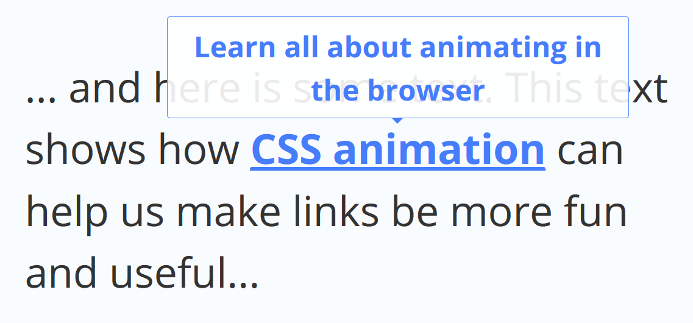

# CSS Animation - Touch And Hover Animations | Tooltip

In this CSS Animation project, we will style a normal boring anchor link into click-inviting anchor link that animates on hover. We also create a tooltip for the link that will appear on hover. The tooltip will smoothly transition into view and also smoothly disappear out of view when mouseout.

[View demo site here.](http://edwinchen.co/css_animation_touch_and_hover_tooltip/)

